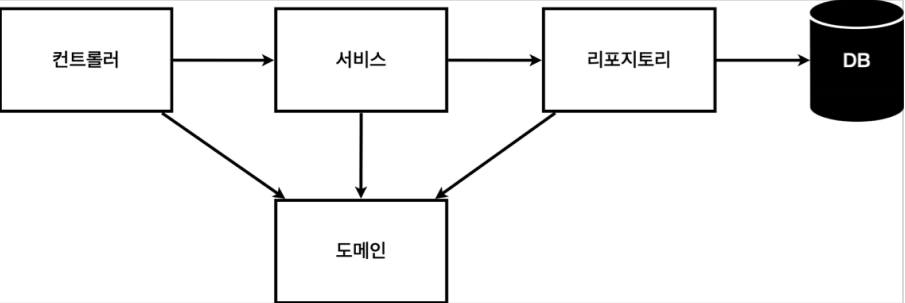

## 프로젝트 환경설정
프로젝트 JDK, Gradle JDK를 java 11로 설정.   
bulid and run을 IntelliJ로 -> 실행 속도 빨라짐   
#### 스프링 부트 라이브러리
* spring-boot-starter-web : 톰캣(웹서버) , 스프링 웹 MVC
* spring-boot-starter-thymeleaf : 타임리프 템플릿 엔진(View)
* spring-boot-starter(공통) : 스프링 부트 + 스프링 코어 + 로깅
* spring-boot-starter-test : 테스트 라이브러리
## 데이터 넘기기
### 정적 컨텐츠
해당 url에 해당하는 controller가 없으면 resource/static/ 으로 가 .html을 찾아서 view 출력
### MVC와 템플릿 엔진
```java
@Controller
public class HelloController {
 @GetMapping("hello-mvc")
 public String helloMvc(@RequestParam("name") String name, Model model) {
  model.addAttribute("name", name);
  return "hello-template";
 }
}
```
해당 url에 해당하는 controller가 없으면 resource/templates/ 으로 가 .html을 찾아서 view 출력    
( viewResolver를 사용 )
### API
```java
// @ResponseBody 객체 반환

@Controller
public class HelloController {
 @GetMapping("hello-api")
 @ResponseBody
 public Hello helloApi(@RequestParam("name") String name) {
  Hello hello = new Hello();
  hello.setName(name);
  return hello;
 }
 static class Hello {
  private String name;
  public String getName() {
  return name;
 }
 public void setName(String name) {
  this.name = name;
 }
}
```
```@Responsebody```를 사용하면 viewResolver 대신 HttpMassageConverter가 동작하여 데이터(문자, 객체, ...)를 JSON으로 처리해줌

## 일반적인 웹 어플리케이션 구조
</img>
* 컨트롤러 : 웹 MVC의 컨트롤러 역할 (service 이용)
* 서비스 : 핵심 비즈니스 로직 구현 (repository 이용)
* 리포지토리 : 데이터베이스에 접근하여 도에인 객체를 저장하고 관리 (db 접근)
* 도메인 : 비즈니스 도메인 객체 (모델), 데이터베이스에 저장하고 관리됨

## 테스트
* ```@Test```를 사용하여 테스트 클래스 생성
* ```@SpringBootTest``` : 스프링 컨테이너 테스트 함께 실행(db 필요할때?)
* ```@AfterEach``` : 테스트 간 영향이 없도록, 한 테스트가 끝날때 마다 실행 (리포지토리 비우기)
* But, ```@Transactional``` : 테스트할때 이 어노테이션이 있으면, 테스트 후 항상 롤백해줌 (테스트 간 영향 X)
* ```@BeforeEach``` : 테스트 간 영향이 없도록, 한 테스트가 시작하기 전에 실행 (새 리포지토리 생성, 의존성 주입)
* But, 필드 주입으로 그냥 DI 시키는게 편함

## 스프링 빈과 의존관계
```@Autowired```를 생성자에 쓰면 스프링이 연관된 객체를 스프링 컨테이너(스프링 빈으로 등록돼있음)에서 찾아서 넣어준다. 이렇게   
객체 의존관계를 외부에서 넣어주는 것을 DI(의존성 주입)이라 함
 * ```@Autowired```를 통한 DI는 스프링이 관리하는 (스프링 빈으로 등록된) 객체에서만 동작함.
 * DI에는 필드 주입(간편하지만 로직 수정 힘듬), setter 주입, 생성자 주입이 있는데 생성자 주입 추천
### 스프링 빈 등록 방법
* 컴포넌트 스캔 방법 - 정형화된 방식일때    
    ```@Controller```, ```@Service```, ```@Repository```등의 어노테이션을 붙여 자동 등록하게함

* 직접 스프링 빈에 등록하는 방법 - 상황에 따라 구현체가 바뀔때 
```java
@Configuration // 스프링 시작할때 먼저 실행
public class SpringConfig { // config 클래스를 생성해서 직접 빈으로 등록해줌.
 @Bean
 public MemberService memberService() {
  return new MemberService(memberRepository());
 }
 @Bean
 public MemberRepository memberRepository() {
  return new MemoryMemberRepository();
 }
```
## 스프링 DB 접근

### JPA
* 도메인에  ```@Entity```매핑, pk 필드에  ```@id```,  ```@@GeneratedValue(strategy = GenerationType.IDENTITY)``` 매핑

```java
public class JpaMemberRepository implements MemberRepository {
 private final EntityManager em; // 엔티티 관련 JPA 관리자 역할
 public JpaMemberRepository(EntityManager em) {
  this.em = em;
 }
 public Member save(Member member) {
  em.persist(member); // 저장하는 JPA 쿼리문
  return member;
 }
 public Optional<Member> findById(Long id) {
  Member member = em.find(Member.class, id); // 조회하는 JPA 쿼리문
  return Optional.ofNullable(member); // null일 경우 빈 optional 반환
 }
 public List<Member> findAll() { // 리스트로 받아오려면 쿼리문 작성 해야함. 스프링 데이터 JPA를 쓰면 간편하게 쿼리 안쓰고 가능
  return em.createQuery("select m from Member m", Member.class)
  .getResultList();
 }
 public Optional<Member> findByName(String name) {
  List<Member> result = em.createQuery("select m from Member m where 
  m.name = :name", Member.class)
  .setParameter("name", name)
  .getResultList();
  return result.stream().findAny();
 }
}
```
* JPA를 통한 모든 db 데이터의 변경은 트랜잭션 안에서 실행해야 한다(```@Transactional``` 매핑 필요).

### 스프링 데이터 JPA
* findByName() 같이 메서드 이름으로 쿼리 안쓰고 조회 가능
## 유용한 문법들
```Optional<T>``` - null 예외처리 편해짐     
```.stream()```, ```.filter()```, ```.findany()``` - Optional 객체들을 필터링해서 하나 찾으면 반환
